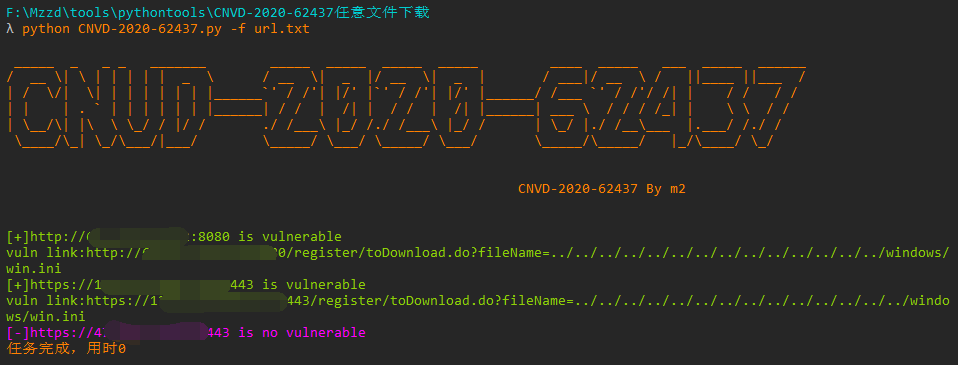
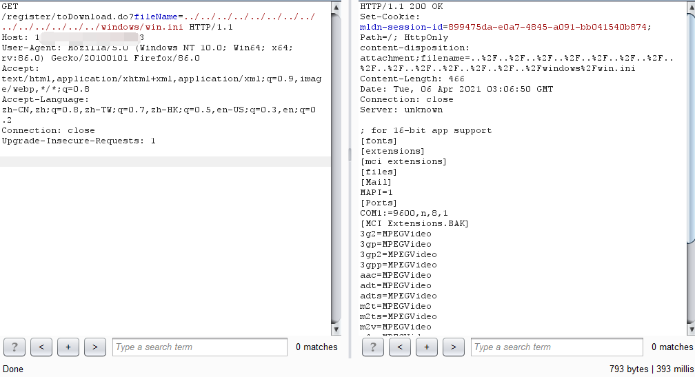

# CNVD-2020-62437
银澎云计算 好视通视频会议系统存在任意文件下载，攻击者可以通过漏洞获取敏感信息。

## 漏洞编号

CNVD-2020-62437

## 工具利用

python3 CNVD-2020-62437.py -u http://127.0.0.1:1111 单个url测试

python3 CNVD-2020-62437.py -f url.txt 批量检测

## exp利用

## 免责声明

由于传播、利用此文所提供的信息而造成的任何直接或者间接的后果及损失，均由使用者本人负责，作者不为此承担任何责任。
