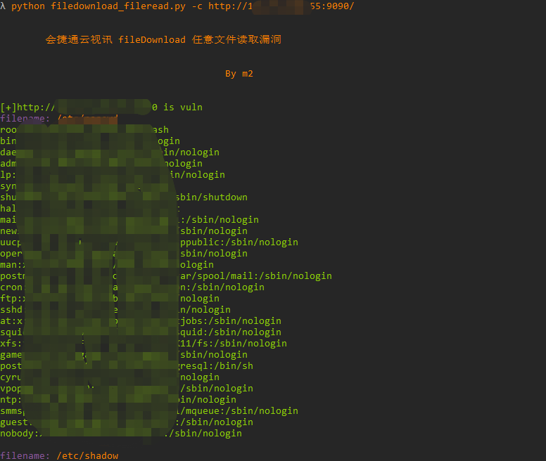

# hjt_fileread

会捷通云视讯存在任意文件读取漏洞

## 工具利用

python3 filedownload_fileread.py -u http://127.0.0.1:1111 单个url测试

python3 filedownload_fileread.py -f url.txt 批量getshell

python3 filedownload_fileread.py -c http://127.0.0.1:1111 进入cmd

## 免责声明

由于传播、利用此文所提供的信息而造成的任何直接或者间接的后果及损失，均由使用者本人负责，作者不为此承担任何责任。

