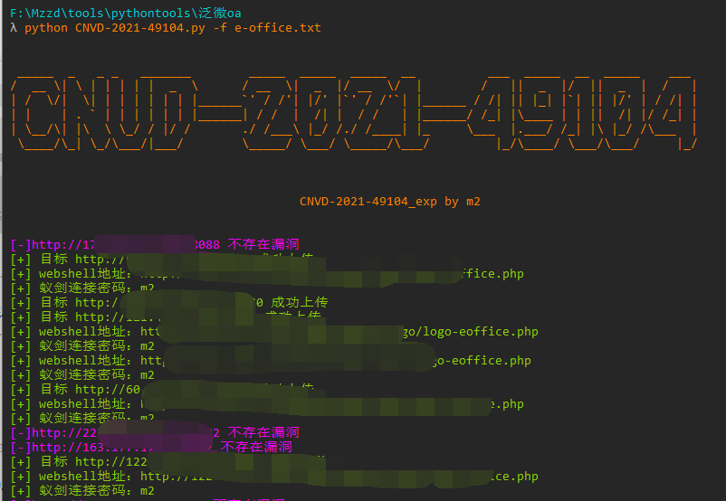
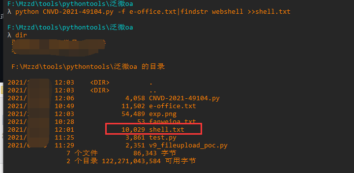

# CNVD-2021-49104
泛微E-Office文件上传漏洞

## 工具利用

python3 CNVD-2021-49104.py -u http://127.0.0.1:8082 单个url测试

python3 CNVD-2021-49104.py -f url.txt 批量检测

使用蚁剑连接时最好别用默认编码器

只输出webshell地址到txt请执行

python CNVD-2021-49104.py -f e-office.txt|findstr webshell >>shell.txt

即可在当前路径下生成shell.txt

## 免责声明

由于传播、利用此文所提供的信息而造成的任何直接或者间接的后果及损失，均由使用者本人负责，作者不为此承担任何责任。
