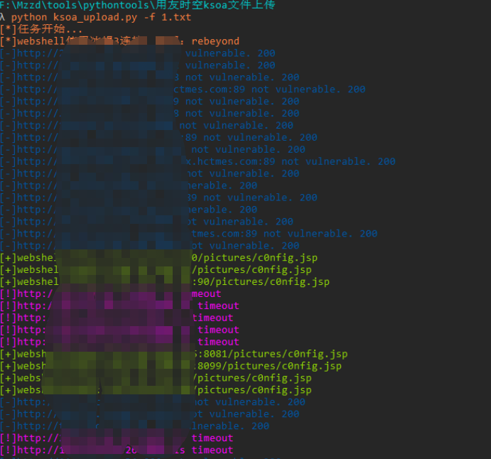

# KSOA_upload
用友时空KSOA系统ImageUpload存在文件上传漏洞，攻击者可利用该漏洞获取服务器权限。

## Fofa指纹

app="用友-时空KSOA"

## 工具利用

python3 ksoa_upload.py -u http://127.0.0.1:1111 单个url测试

python3 ksoa_upload.py -f url.txt 批量检测

扫描结束后会在当前目录生成存在漏洞url的vuln.txt

poc：

## 免责声明

由于传播、利用此文所提供的信息而造成的任何直接或者间接的后果及损失，均由使用者本人负责，作者不为此承担任何责任。
