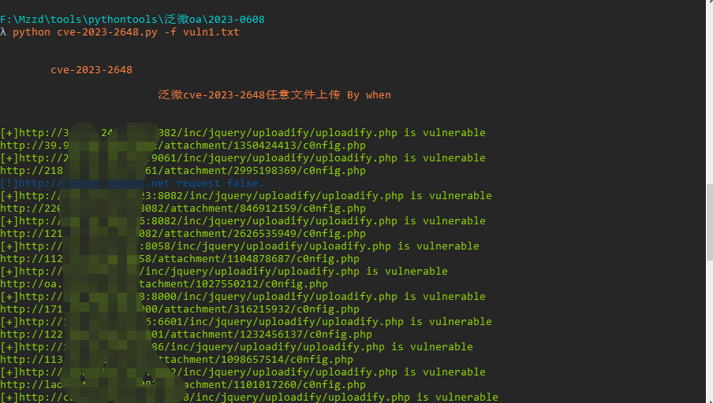
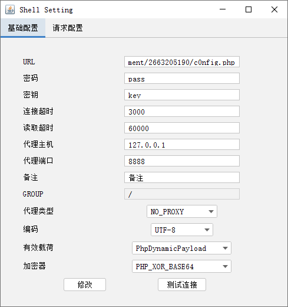

# CVE-2023-2648
泛微 E-Office 9.5版本中文件上传处理程序接口uploadify.php参数Filedata存在任意文件上传，攻击者可以通过远程控制接口上传恶意文件。

## 工具利用

python3 CVE-2023-2648.py -u http://127.0.0.1:1111 单个url测试

python3 CVE-2023-2648.py -f url.txt 批量getshell

用哥斯拉连接

## 免责声明

由于传播、利用此文所提供的信息而造成的任何直接或者间接的后果及损失，均由使用者本人负责，作者不为此承担任何责任。
