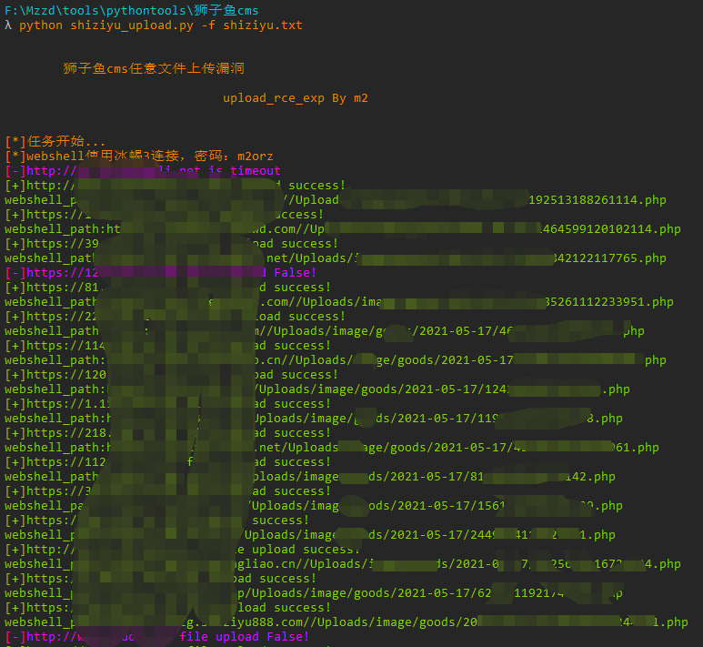

# shiziyu_upload

狮子鱼cms wxapp.php存在任意文件上传漏洞，攻击者可直接上传木马获取服务器权限。

## 漏洞影响

狮子鱼cms

## FOFA指纹

"/seller.php?s=/Public/login"

## 工具利用

python3 shiziyu_upload.py -u http://127.0.0.1:1111 单个url测试

python3 shiziyu_upload.py -f url.txt 批量getshell

## 免责声明

由于传播、利用此文所提供的信息而造成的任何直接或者间接的后果及损失，均由使用者本人负责，作者不为此承担任何责任。
