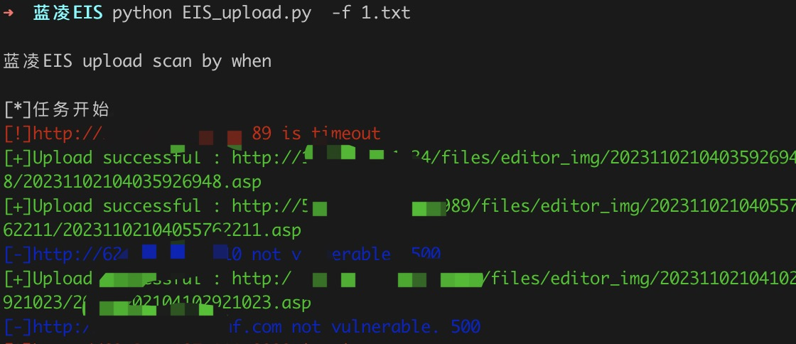

# 蓝凌EIS saveIm 文件上传
蓝凌EIS智慧协同平台saveImg接口存在任意文件上传漏洞

## 工具利用

python3 EIS_upload.py -u http://127.0.0.1:8082 单个url测试

python3 EIS_upload.py -f url.txt 批量检测

## 免责声明

由于传播、利用此文所提供的信息而造成的任何直接或者间接的后果及损失，均由使用者本人负责，作者不为此承担任何责任。
