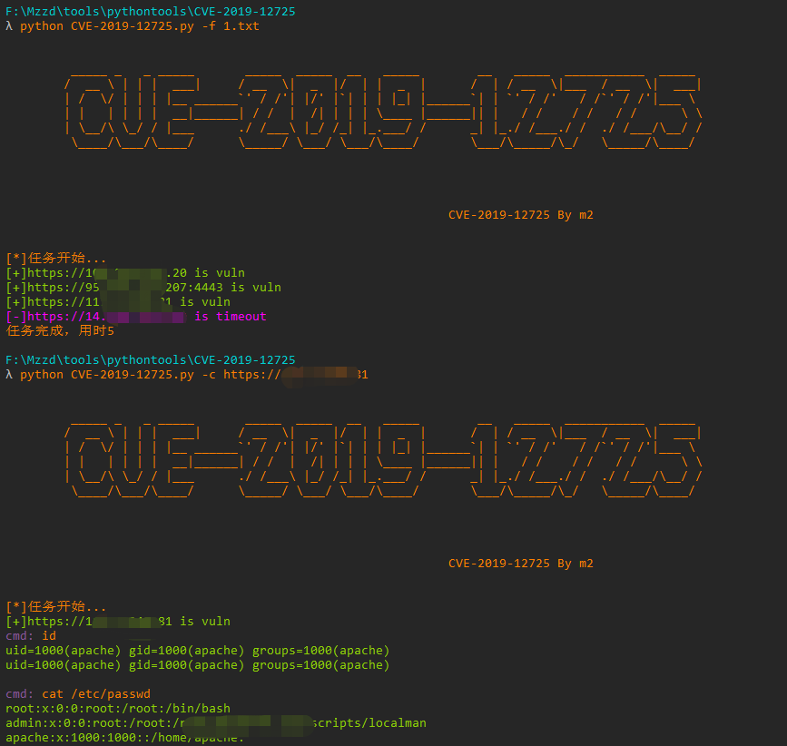

# CVE-2019-12725
ZeroShell存在命令执行漏洞，导致攻击者可执行任意命令

## 工具利用

python3 CVE-2019-12725.py -u http://127.0.0.1:1111 单个url测试

python3 CVE-2019-12725.py -c http://127.0.0.1:1111 cmdshell模式

python3 CVE-2019-12725.py -f url.txt 批量检测

## 免责声明

由于传播、利用此文所提供的信息而造成的任何直接或者间接的后果及损失，均由使用者本人负责，作者不为此承担任何责任。
