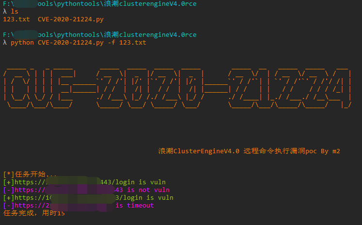
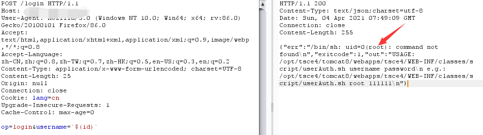

# CVE-2020-21224
浪潮ClusterEngineV4.0存在危险字符未过滤，导致远程命令执行。

## 漏洞编号

CVE-2020-21224

## 工具利用

python3 CVE-2020-21224.py -u http://127.0.0.1:1111 单个url测试

python3 CVE-2020-21224.py -f url.txt 批量检测

## exp利用

## 免责声明

由于传播、利用此文所提供的信息而造成的任何直接或者间接的后果及损失，均由使用者本人负责，作者不为此承担任何责任。
