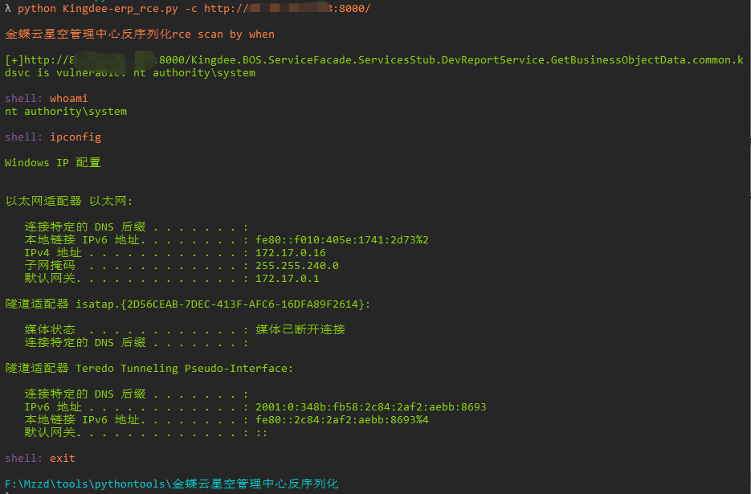
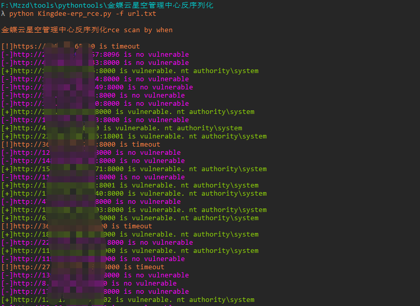

# Kingdee_erp_Unserialize_rce

金蝶云星空是一款云端企业资源管理（ERP）软件，为企业提供财务管理、供应链管理以及业务流程管理等一体化解决方案。系统存在反序列化命令执行漏洞

## 影响范围：

6.x版本：低于6.2.1012.4
7.x版本：7.0.352.16 至 7.7.0.202111
8.x版本：8.0.0.202205 至 8.1.0.20221110

## 工具利用

python3 Kingdee-erp_rce.py -u http://127.0.0.1:1111 单个url测试

python3 Kingdee-erp_rce.py -c http://127.0.0.1:1111 cmdshell模式

python3 Kingdee-erp_rce.py -f url.txt 批量检测 扫描会自动保存存在漏洞的url到vuln.txt

## 免责声明

由于传播、利用此文所提供的信息而造成的任何直接或者间接的后果及损失，均由使用者本人负责，作者不为此承担任何责任。
