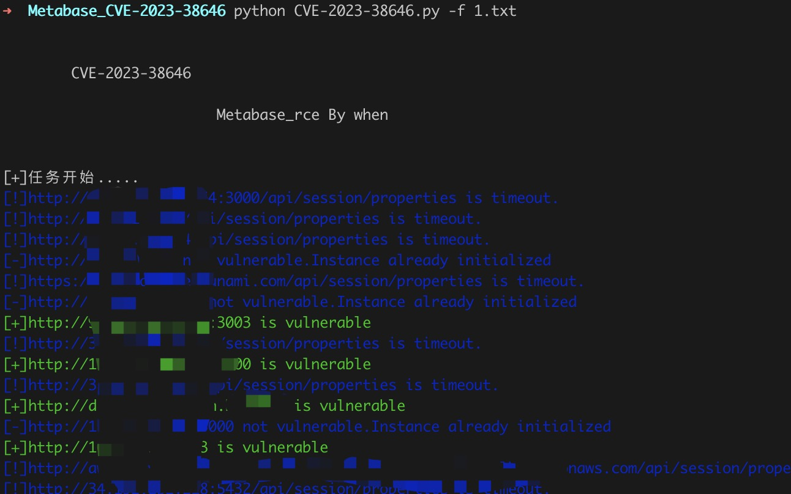
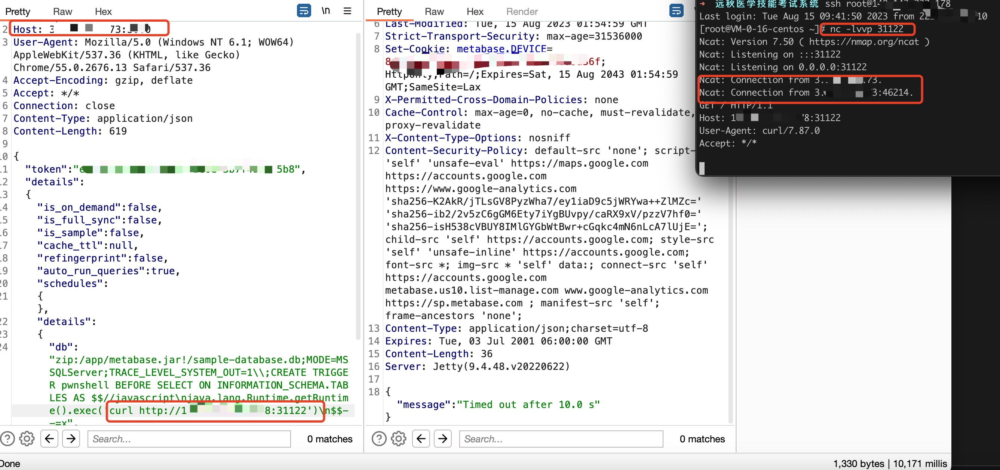

# Metabase 远程命令执行漏洞 CVE-2023-38646

Metabase是一个开源的数据分析和可视化工具，它可以帮助用户轻松地连接到各种数据源，包括数据库、云服务和API，然后使用直观的界面进行数据查询、分析和可视化。未经身份认证的远程攻击者利用该漏洞可以在服务器上以 Metabase 服务器的权限执行任意命令

## 工具利用

python3 CVE-2023-38646.py -u http://127.0.0.1:1111 单个url测试

python3 CVE-2023-38646.py -f url.txt 批量检测

## exp利用

将脚本流量转发到burp

修改exec参数执行其他命令

## 免责声明

由于传播、利用此文所提供的信息而造成的任何直接或者间接的后果及损失，均由使用者本人负责，作者不为此承担任何责任。
