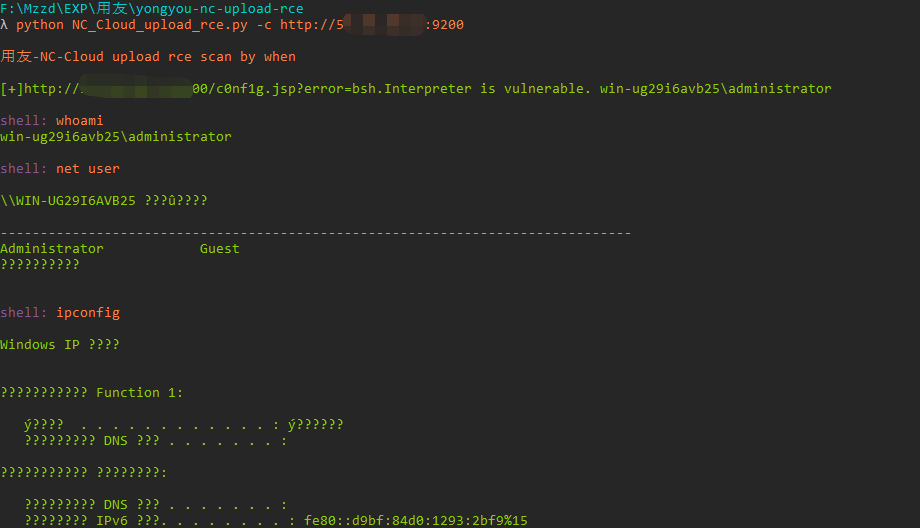
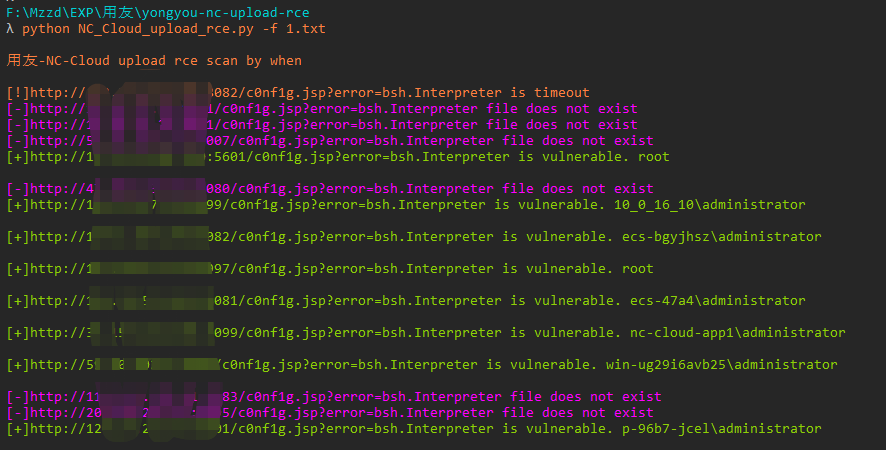

# Yongyou_NC_Cloud_upload_rce

用友网络科技股份有限公司NC Cloud存在命令执行漏洞，攻击者可利用该漏洞获取服务器控制权。

## fofa查询

app="用友-NC-Cloud"

## 工具利用

python3 NC_Cloud_upload_rce.py -u http://127.0.0.1:1111 单个url测试

python3 NC_Cloud_upload_rce.py -c http://127.0.0.1:1111 cmdshell模式

python3 NC_Cloud_upload_rce.py -f url.txt 批量检测 扫描会自动保存存在漏洞的url到vuln.txt

## 免责声明

由于传播、利用此文所提供的信息而造成的任何直接或者间接的后果及损失，均由使用者本人负责，作者不为此承担任何责任。
