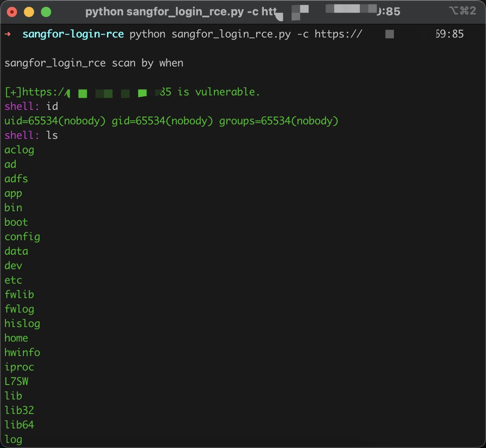
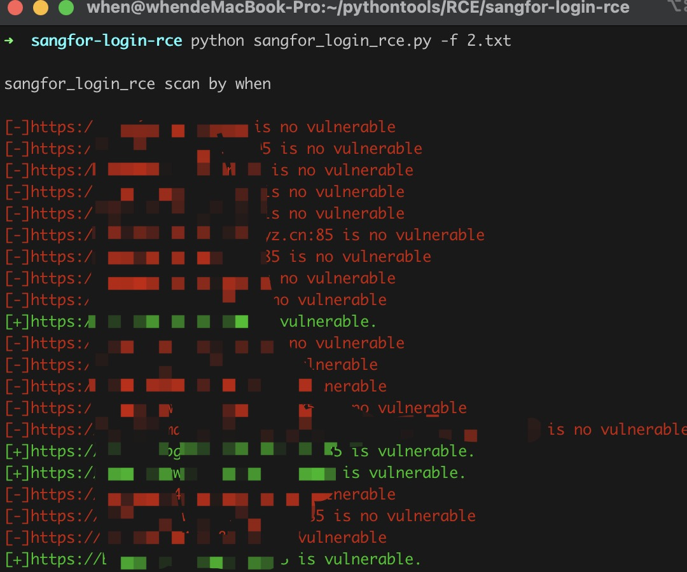

# sangfor-login-rce

深信服 应用交付管理系统 login 文件存在远程命令执行漏洞，攻击者可利用该漏洞获取服务器权限，执行任意命令

## 影响范围：

深信服 应用交付管理系统 7.0.8-7.0.8R5

## 工具利用

python3 sangfor_login_rce.py -u http://127.0.0.1:1111 单个url测试

python3 sangfor_login_rce.py -c http://127.0.0.1:1111 cmdshell模式

python3 Kingdee-erp_rce.py -f url.txt 批量检测 

扫描会自动保存存在漏洞的url到vuln.txt

## 免责声明

由于传播、利用此文所提供的信息而造成的任何直接或者间接的后果及损失，均由使用者本人负责，作者不为此承担任何责任。
