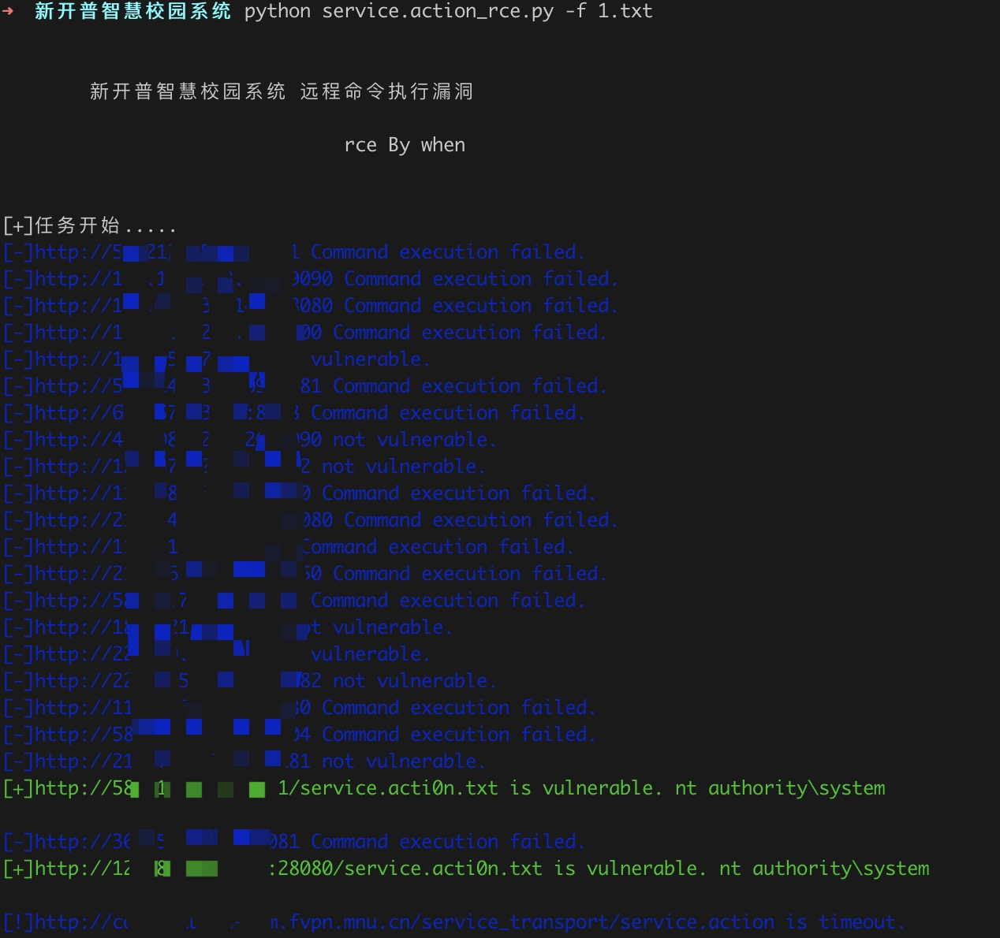
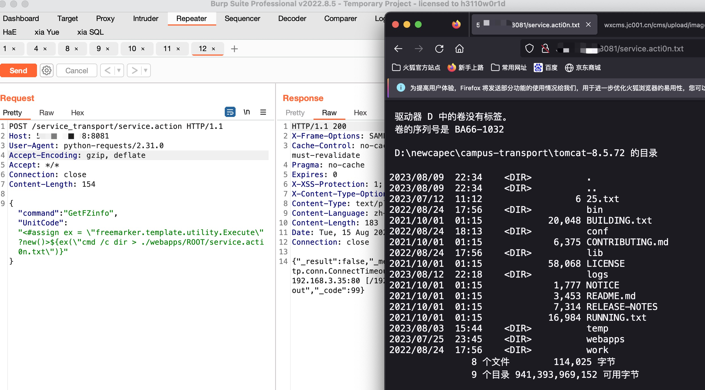

# 新开普智慧校园系统命令执行漏洞

新开普智慧校园系统/service_transport/service.action接口处存在远程命令执行漏洞，攻击者通过漏洞可以获取服务器权限

## 工具利用

python3 service.action_rce.py -u http://127.0.0.1:1111 单个url测试

python3 service.action_rce.py -f url.txt 批量检测

## exp利用

将脚本流量转发到burp

修改exec参数执行其他命令

## 免责声明

由于传播、利用此文所提供的信息而造成的任何直接或者间接的后果及损失，均由使用者本人负责，作者不为此承担任何责任。
