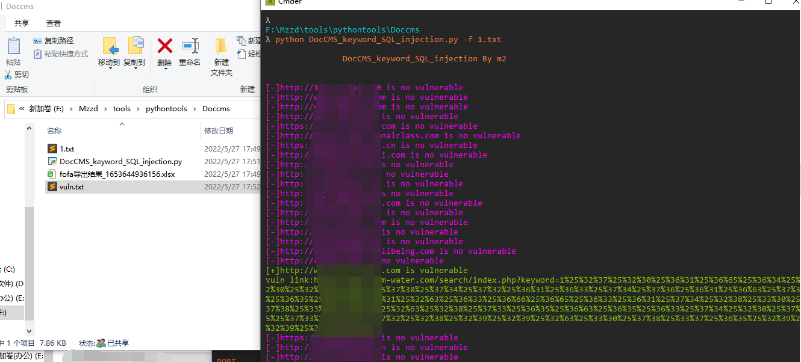

# Doccms-sql-injection

DocCMS keyword SQL注入漏洞批量扫描poc

## 工具利用

python3 DocCMS_keyword_SQL_injection.py -u http://127.0.0.1:1111 单个url测试

python3 DocCMS_keyword_SQL_injection.py -f url.txt 批量检测
会在当前目录生成存在漏洞的txt文件

## 免责声明

由于传播、利用此文所提供的信息而造成的任何直接或者间接的后果及损失，均由使用者本人负责，作者不为此承担任何责任。
