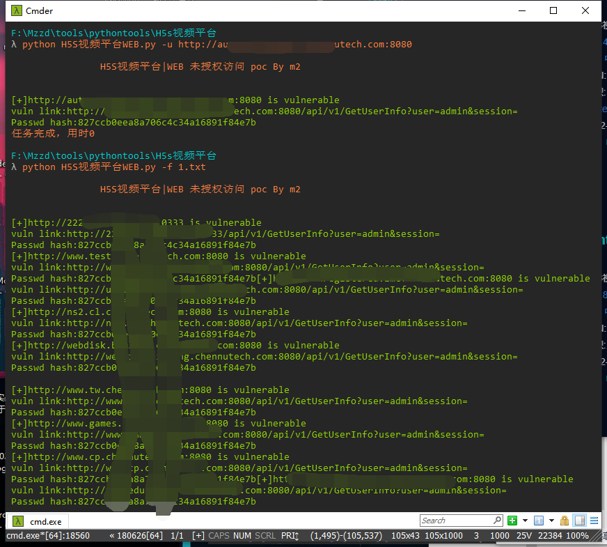
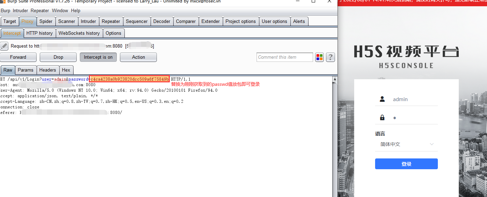

# CNVD-2020-67113

零视技术(上海)有限公司H5S CONSOLE存在未授权访问漏洞。攻击者可利用漏洞访问后台。

## 工具利用

python3 CNVD-2020-67113.py -u http://127.0.0.1:1111 单个url测试

python3 CNVD-2020-67113.py -f url.txt 批量检测
会在当前目录生成存在漏洞的txt文件

拦截请求替换passwd值登录

## 免责声明

由于传播、利用此文所提供的信息而造成的任何直接或者间接的后果及损失，均由使用者本人负责，作者不为此承担任何责任。
