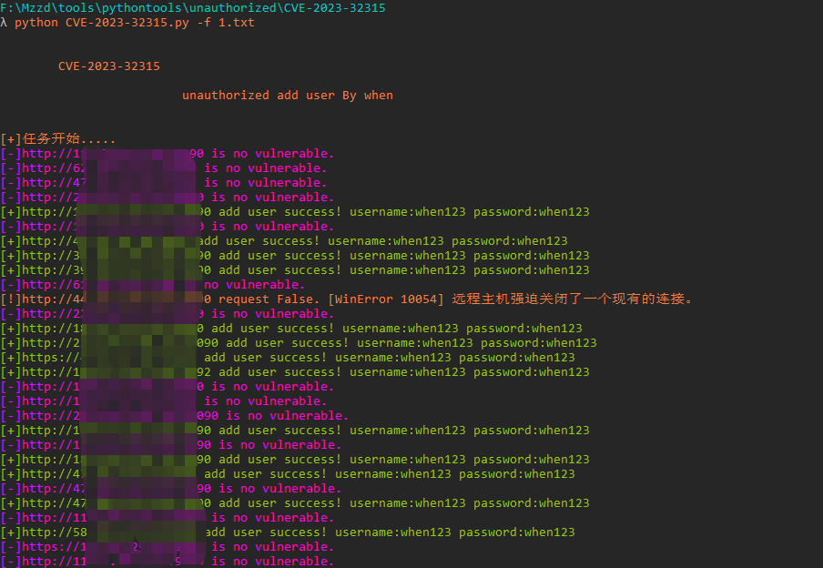

# CVE-2023-32315
Openfire身份认证绕过漏洞

## 影响范围

3.10.0 <= Openfire < 4.6.8

4.7.0 <= Openfire 4.7.x < 4.7.5

## 工具利用

python3 CVE-2023-32315.py -u http://127.0.0.1:1111 单个url测试

python3 CVE-2023-32315.py -f url.txt 批量检测

## 免责声明

由于传播、利用此文所提供的信息而造成的任何直接或者间接的后果及损失，均由使用者本人负责，作者不为此承担任何责任。
