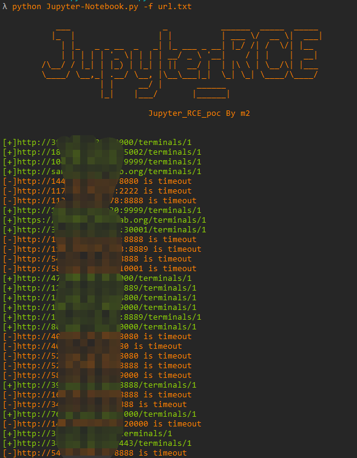
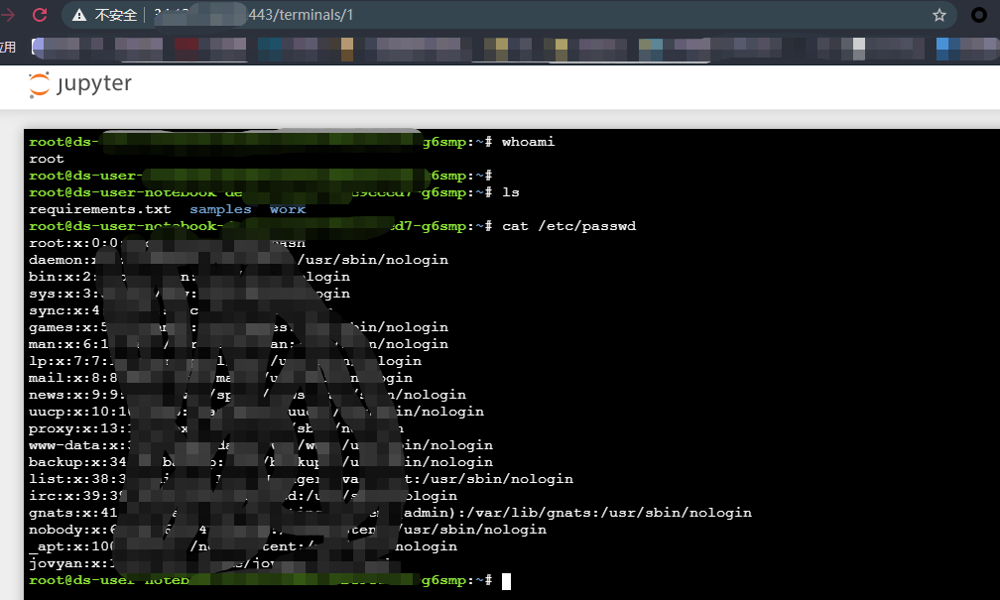

# Jupyter-Notebook
Jupyter Notebook未授权访问漏洞批量扫描poc，如果管理员未为Jupyter Notebook配置密码，游客可在其中创建一个console并执行任意Python代码和命令。

## 工具利用

python3 Jupyter-Notebook.py -u http://127.0.0.1:1111 单个url测试

python3 Jupyter-Notebook.py -f url.txt 批量检测

## 免责声明

由于传播、利用此文所提供的信息而造成的任何直接或者间接的后果及损失，均由使用者本人负责，作者不为此承担任何责任。
