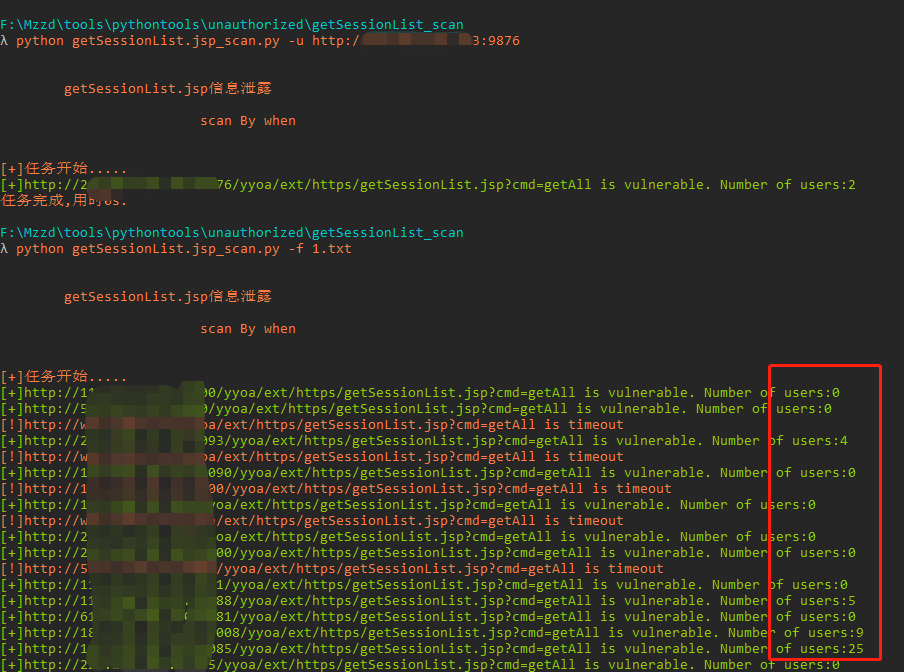
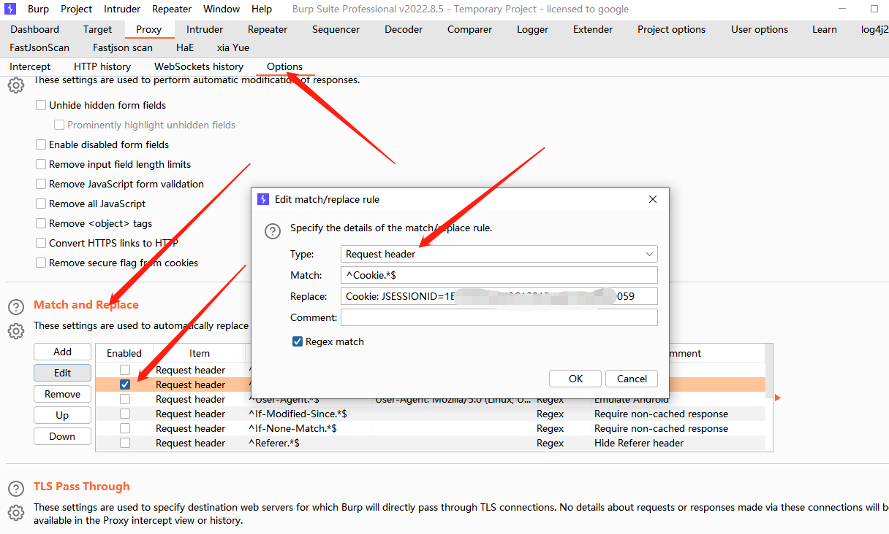
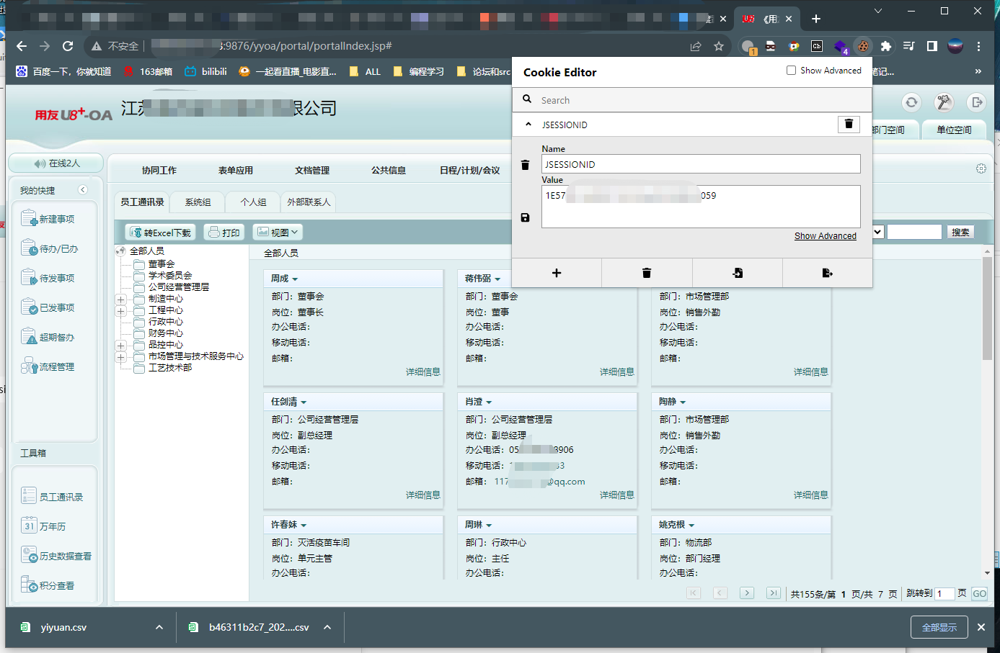

# 用友致远U8-OA getSessionList jsp信息泄露

用友U8-OA和致远A6系统getSessionList.jsp文件存在漏洞，攻击者可利用漏洞获取到所有用户的SessionID，利用泄露的SessionID即可登录该用户并获取shell。

## 工具利用

python3 getSessionList.jsp_scan.py -u http://127.0.0.1:1111 单个url测试

python3 getSessionList.jsp_scan.py -f url.txt 批量检测

会在当前目录生成存在漏洞的session.txt文件

最后一列显示的是当前在线用户数量

## exp
访问session.txt中的链接可以看到用户cookie值

替换cookie值登录

方法1：
burp拦截请求替换cookie值

方法2：
谷歌插件:https://chrome.google.com/webstore/detail/cookie-editor/hlkenndednhfkekhgcdicdfddnkalmdm/related?hl=zh-CN

访问yyoa/portal/portalIndex.jsp，进入首页

## 免责声明

由于传播、利用此文所提供的信息而造成的任何直接或者间接的后果及损失，均由使用者本人负责，作者不为此承担任何责任。
