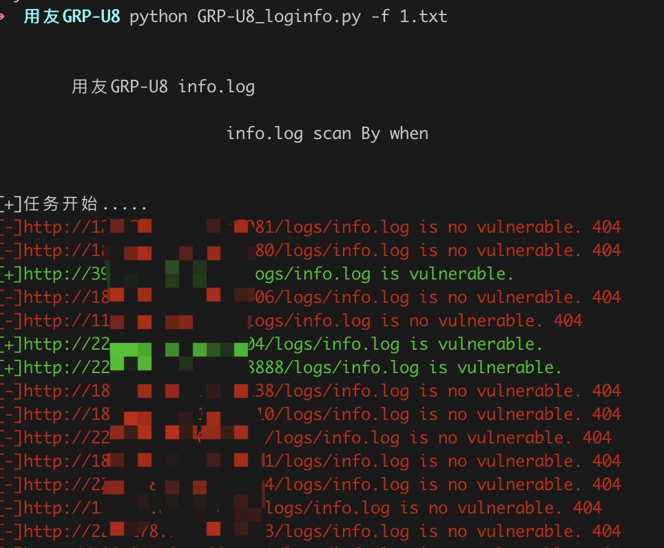
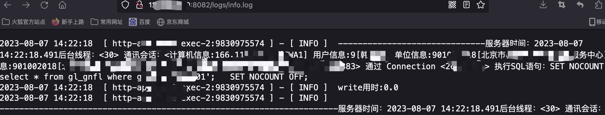

# 用友GRP-U8 info.log信息泄露

用友U8系统存可直接访问log日志，泄露敏感信息

## 工具利用

python3 GRP-U8_loginfo.py -u http://127.0.0.1:1111 单个url测试

python3 GRP-U8_loginfo.py -f url.txt 批量检测

会在当前目录生成存在漏洞的vuln.txt文件

## exp

访问vuln.txt中的链接

## 免责声明

由于传播、利用此文所提供的信息而造成的任何直接或者间接的后果及损失，均由使用者本人负责，作者不为此承担任何责任。
